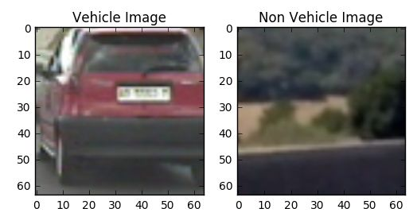
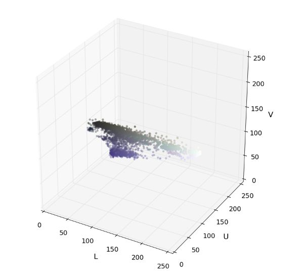
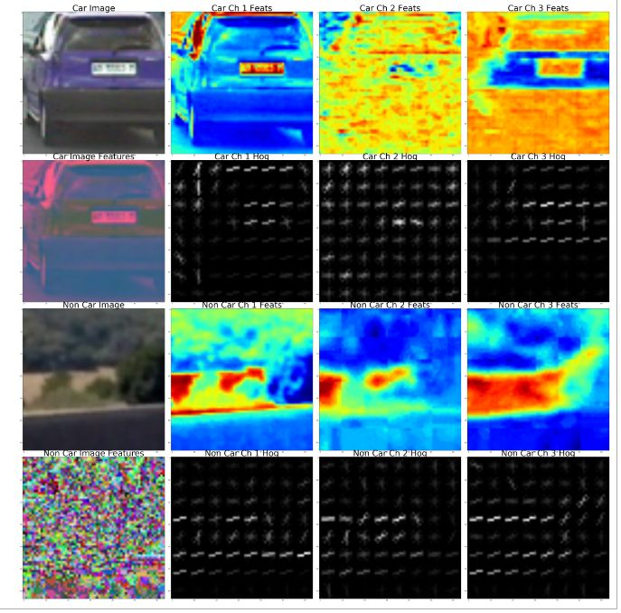
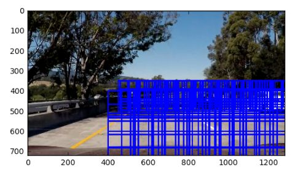
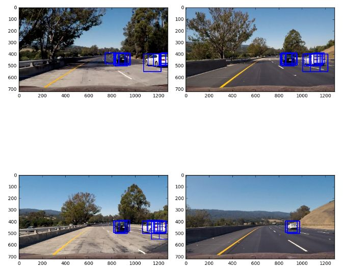
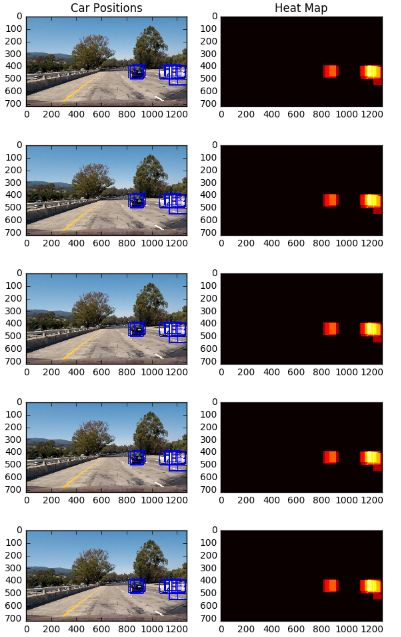
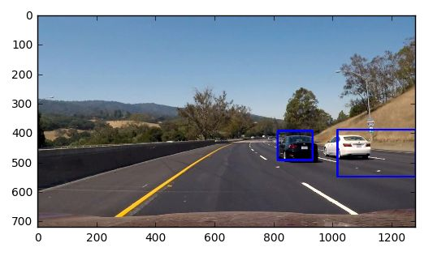
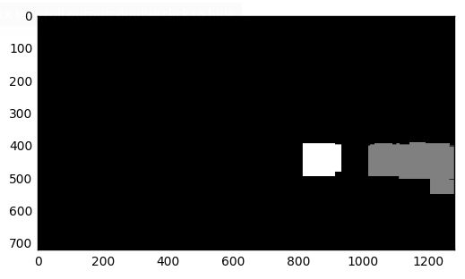

# Vehicle Tracking
#### Joseph Voyles

## Feature Extraction

#### Overview
Image features are extracted in the project notebook within the Train Classifier section. The function extract_features() and single_image_features() both contain code for extraction. These functions extract color, spatial and hog features for a list or single image. The functions aggregate individual functions for feature selection that include colorFeatures, color_hist and hog_features, and they aggregate the results into a single feature vector for the image.

The feature extraction process is conducted as follows:

1. Both veh and non vehicle images are read from the directories

2. Color spaces and hog channels were explored to understand which features would provide the best information for classifation. The following provides an example of the features for a sample vehicle and non vehicle image

3. Once a set of features were established, the images are passed to the extract_features function to create an aggregate feature vector

## Classifier Tunning

#### Selecting HOG Parameters
After experimenting with several combinations of colors and hog parameters, I selected LUV for the color pallet and HOG features of orienation = 9, pixels per cell of 8, cells per block of 2, and hog channel of 0. These parameters were selected through a process of evaluating individual features to identify those that generated the best simplified represntation of the vehicle. Once an initial estimate was selected, passed them through the classifier and adjusted until I had a model that produced the highest accuracy that I could achieve. I tweaked the feature parameters by first visiting extremes to understand influence of the variables on the model accuracy. I then adjusted my initial parameters slightly from their starting point to tune the classifier.

#### Classifier Optimization
The classifier was trainined the Train Classifier section of the notebook. I used a LinearSVM function and trained on the image data with a 70/30 split for train and test data sets.

Outside of adjusting the feature parameters, I had to build the training data set by hand. I tried building the initial classifier by generating a test and train data set by randomly selecting images from the vehicle and non vehicle image sets. This resulted in a model with adequate performance, but it produced far too many fals positives and it failed to consistently pick up vehicles that were more distant.

Given these issues, I came to the conclusion that I overfit the model based on the data set issue that was described in the project description. To begin retraining, I generated a train and test data set manually by making sure that images of the same vehicle were kept together. After retraining the model, testing on the test images and sample video frames, and rerunning on the videos, the overfitting issues seemed to be resolved.

## Window Search

For the window search, I used a sliding window method. I chose window sizes that were capable of capturing a vehicle at different positions. This includes windows of 90, 100, 105, 150, and 270.

In addition to multiple window sizes, I fixed the boxes to only search a region of interest that includes the visible roadway. The smaller boxes were used to search for more distance vehicles and the larger boxes to search for vehicles near the car. This restricted search area was used to limit false positives.

Finally, window overlap of .5 was applied to make sure that the full vehicle was captured. Without the window overlap, some vehicles are missed between frames.

The image below shows the area covered by the window search.

#### Pipeline

An image classifer was trained on LUV, spacitally bound color features and the HOG classified defined in the section above. The images below depict the outputs of applying the window search to a set of test images.

## Video Process

The processed video can be found here:

https://youtu.be/Ubcgy_XWwJw

False posititives are filtered in the process_frame function. False positives were filtered through the following process:
1. Image region of interst was limited to just the road
2. An image mask was applied to mask the top portion of the image so that the window search would not consider this area
3. A threshold filter is applied to each frame
4. When processing the frames, a moving average was applied to the heatmaps. The last 5 frames are averaged and then filtered to avoid including false positive

The images below represent a series of 5 frames after the window search and heat map

The image below shows the labeled image based on the average heatmap

The image below shows the resulting bounding boxes after averaging the heatmap and labeling the frames

## Issues

1. False Positives - Despite optimizing the classifier and fitlering, false positivies still show up in frames. Additional training would be required in addition to some alternative classification models including a deep CNN. Training data collection could be improved, focusing on images that are extracted from a camera setup that is similar to the vehicle that is being trained. 
2. Sliding Window - The pipeline was highly sensitive to window sizes and regions of interest. I could have easily spent several more hours tuning the search window sizes and regions. Distant vehicles are not picked up as often due to the curent configurations, and they are extremely sensitive to the thresholds that are set when filtering the heatmap
3. Smoothing - Bounding boxes contain some jitter and they are not as tight as they could be. The vehicles are identified and tracked, but the boxes move around. An improved method for tracking could include finding the center point of the boxes and tracking or predicting the vehicles movement from frame to frame. This would help stabilize the bounding box. In frames with the passing vehicles, the vehicles merge into 1 box and a new vehicle emerges after the pass is complete. Despite averaging, the pipeline will occassionally pick up multiple vehicles around the same vehicle, resulting in multiple binding boxes. Tracking the labled vehicles could also help with removing false positivies and reducing the number of binding boxes that appear around vehicles.
